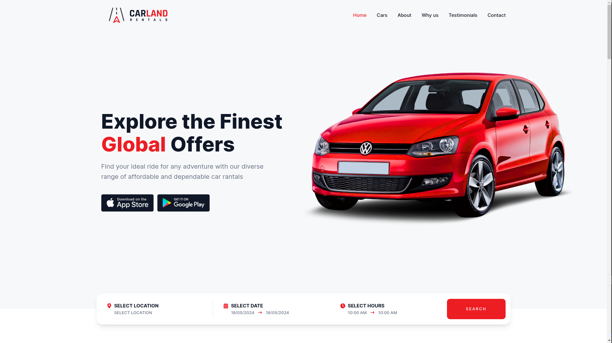

# Website-Aluguel-de-Carros-NextJS

Site para aluguel de automóveis Usando Next.JS v14.2.3, Tailwind CSS e Framer Motion

[Next.js](https://nextjs.org/)
[Tailwind](https://tailwindcss.com/)
[Framer Motion](https://www.framer.com/motion/)

## Getting Started

Primeiro, execute o servidor de desenvolvimento:

```bash
npm run dev
# ou
yarn dev
# ou
pnpm dev
# ou
bun dev
```

Abra [http://localhost:3000](http://localhost:3000) com seu navegador para ver o resultado.

##




Caso alguém queria criar o mesmo design, seguindo um tutorial em vídeo: https://www.youtube.com/watch?v=iWAUAOqCHks
